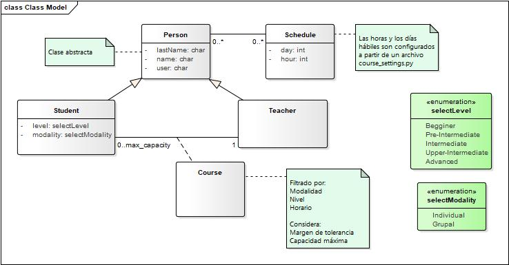
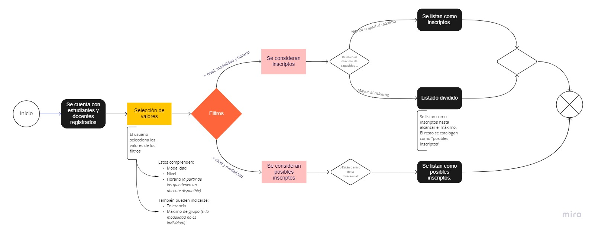

# FAQ: Frequently Asked Questions 
## (about model stuff)

_Algunas aclaraciones sobre el modelo de solución._

## Requerimiento => Solución 🚀

### ¿Cómo se tiene una lista de estudiantes y una lista de docentes con sus relativos atributos?

_Se plantea un modelo de clases basado en el paradigma orientado a objetos. Cada entidad responde a su propio CRUD y se relacionan con la clase Schedule en función de definir su horario._

_Diagrama de clases de dominio:_

### ¿Cómo se obtiene la lista de cursos posibles?

Las condiciones:

#### 👉🏽 Los cursos tienen que respetar el horario que el docente tiene disponible.

_Solo se admite seleccionar, al momento de matchear, los horarios pertenecientes a la disponibilidad de un docente_

#### 👉🏽 Los cursos tienen que respetar el horario disponible de los estudiantes.

_Se hará matcheo de los estudiantes que tengan el mismo horario seleciconado_

#### 👉🏽 Todos los inscriptos en el curso tienen que tener el mismo nivel.

_Se matcheará a partir del nivel seleccionado por el usuario_

#### 👉🏽 Los cursos grupales pueden contener hasta 6 inscriptos. Los cursos individuales sólo pueden contener 1 inscripto.

* _El máximo grupal se considera una condición que puede variar_
* 📢*Modalidad individual siginifica que el "grupo" será de 1*
* 📢*Modalidad grupal corresponde a un grupo de X número de inscriptos*
* _Si se selecciona formar cursos en modalidad Grupal, el X número es ingresado por el usuario_

#### 👉🏽 ¿Y si estas condiciones pueden ir sufriendo modificaciones con el tiempo?

_Desde el archivo `courses_settings.py` es posible configurar:_
* _días y horas hábiles_
* _tolerancia_
* _capacidad máxima de grupos_
* _los niveles disponibles_
* _las modalidades disponibles_

## Nice to have:
* ¿Cómo tener una lista de los estudiantes que no pudieron ser asignados porque no cumplen con alguna de las condiciones?
~~En producción~~

* ¿Cómo matchear también los que difieren de 1h o X configurable?
_El usuario introduce un nivel de tolerancia para obtener, separado del listado de inscriptos, uno de posibles inscriptos._

_Diagrama del Happy Path relativo a los filtros:_

¿Más preguntas? Bienvenidas! 🤓

